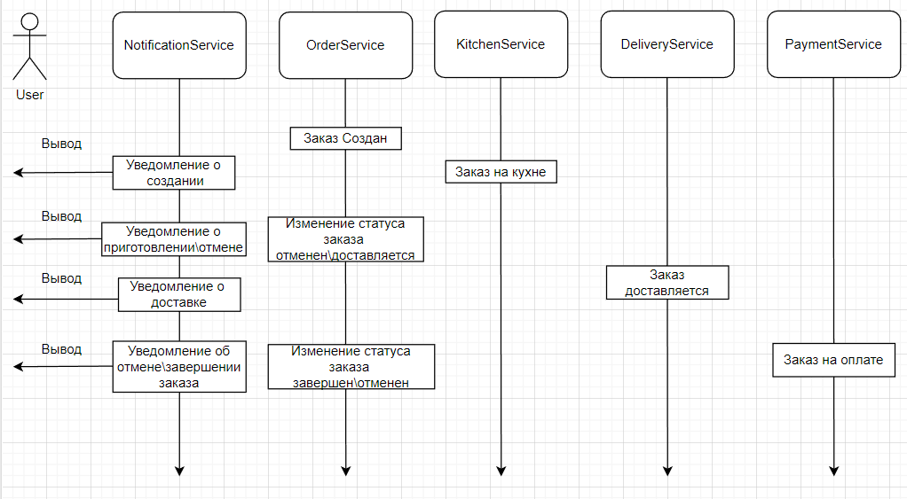

# Проект "FoodDelivery"

## Описание проекта.

Данный проект, созданный на REST принципах, является центральной частью микросервисного проекта, имитирующего сервис доставки еды. 

## Схема работы сервиса.

## Стек.

- **Java 17**
- **Spring Boot 2.7.10**
- **Spring Data**
- **PostgreSQL 14**
- **Lombok**

## Требования.

- **Java 17**
- **Maven 3.8**
- **PostgresSQL 14**

## Запуск проекта.
